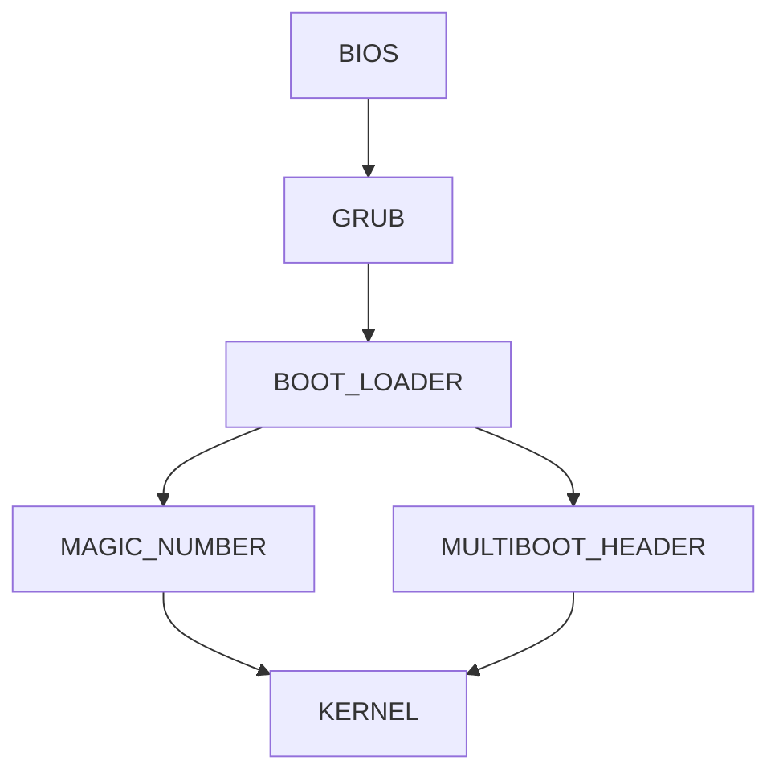
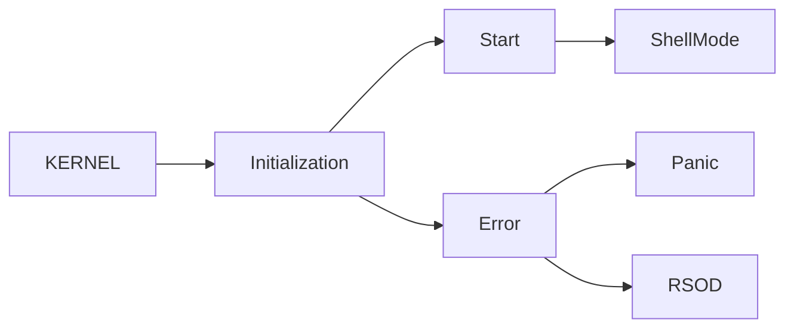

<!--<center>

</center> -->

# Kronos

 **KronOS** is a lightweight Unix-like kernel writen in C and ASM.<br>
This is the result of the **KFS** projects available at School 42.
The kernel is currently not finished. I will make major improvements as soon as possible.

[](https://github.com/vvaucoul/KronOS/actions/workflows/workflow.yml)
[](https://www.codefactor.io/repository/github/vvaucoul/kronos)
---

### Requirements

* <strong>GCC</strong> (<https://gcc.gnu.org/>)
* <strong>CLANG</strong> (<https://clang.llvm.org/>)
* <strong>KVM</strong> (<https://www.linux-kvm.org/>)
* <strong>QEMU</strong> (<https://qemu.org/>)

### Otional tools

* <strong>CCACHE</strong> (<https://github.com/ccache/ccache>)

### Setup

* Clone Kernel Repository

```bash
git clone https://github.com/vvaucoul/KronOS && cd KronOS
```

* Install dependencies

```bash
make install-dependencies
```

* Compiling Kernel

```bash
make 
```

* Start the Kernel with one of the following commands:

```bash
make run / make run-iso / make run-sdl / make run-curses / make run-debug
```

---

### KFS - SERIES

* [x] <strong>KFS-1</strong> : Grub / Boot and Screen
* [x] <strong>KFS-2</strong> : GDT & Stack
* [x] <strong>KFS-3</strong> : Memory
* [x] <strong>KFS-4</strong> : Interrupts
* [ ] <strong>KFS-5</strong> : Processes -----------> **<i>in progress</i>**
* [ ] <strong>KFS-6</strong> : Filesystem
* [ ] <strong>KFS-7</strong> : Syscalls, Sockets & env
* [ ] <strong>KFS-8</strong> : Kernel Modules
* [ ] <strong>KFS-9</strong> : ELF Parser
* [ ] <strong>KFS-X</strong> : Complete Unix System

##### Documentation

* <strong>[WIKI OSDEV](https://wiki.osdev.org/Expanded_Main_Page)</strong>
* <strong>[OSDEVER](http://www.osdever.net/bkerndev/Docs/title.htm)</strong>
* <strong>[PAGING](http://www.jamesmolloy.co.uk/tutorial_html/6.-Paging.html)</strong>
* <strong>[CODE PROJECT](https://www.codeproject.com/Articles/1225196/Create-Your-Own-Kernel-In-C-2)</strong>
* <strong>[MEMORY MANAGMENT](https://www.reddit.com/r/osdev/comments/v97asm/memory_management/)</strong>

---

### Features

* [x] Basic Kernel System
* [x] Boot via Grub 2
* [x] ASM Bootable base
* [x] Kernel Library with basics functions and types (cf. <strong>[HEPHAISTOS](https://github.com/vvaucoul/hephaistos)</strong>)
* [x] Keyboard Support
* [x] VGA Driver
* [x] GDT implementation
* [x] Interrupts and IRQs support
* [x] A Complete Memory system
* [x] Physical and Virtual Memory
* [x] Multi-Tasking System

### GRUB 2 with Multiboot 1

> Grub 2 Usage: [OSDEV](https://wiki.osdev.org/GRUB)<br>
> Multiboot 1 Usage: [GNU](https://www.gnu.org/software/grub/manual/multiboot/multiboot.html)

### Boot Sequence



</img>
</img>

---

### The KERNEL itself

When the kernel is launched, it will initialize each element and test them to validate the kernel launch correctly.<br>
Otherwise, a pretty red death screen will appear or a simple kernel panic.<br>

This one can be managed by the kerrno library created to detect kernel errors for each element.<br>
RSOD and Kerrno / Kernel Panic both use **C** and **ASM**.

</img>
</img>

> BSOD Like (Red Screen Of Death)

</img>

---



---

### Panic

> Panic Examples:

</img>
</img>

🚧 ... Next redaction pending ...🚧
